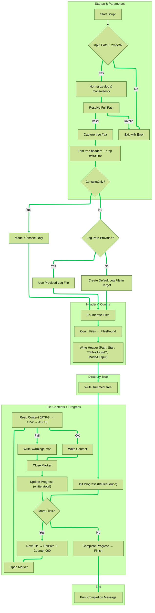

# GSCT – Generate Script Content Tree

GSCT is a PowerShell utility that analyzes a directory and produces a full text report containing:

- A header with execution metadata (path, timestamp, **files found**)  
- A complete directory tree (using `tree /f /a`, header trimmed)  
- The content of each file found, wrapped in start/end markers  
- Flexible output modes (file, custom log path, **console‑only**)  
- A **console progress bar** showing `{written}/{total}` while writing file contents

This tool is useful for auditing folder structures, debugging scripts, documenting codebases, or creating complete content snapshots.

---

## 🚀 Features

- Single `.txt` report containing:
  - Start time, analyzed path
  - **Files found** (total files that will be processed)
  - Directory tree (header lines removed)
  - Full content of each file
- File markers:
  - **Relative path** to the analyzed folder (e.g., `\sub\file.ps1`)
  - **Progressive counter** prefix: `000`, `001`, `002`, …
- Output modes:
  - **Default** → save report inside the analyzed directory  
  - **Custom log file** → `/log:{file}`  
  - **Console‑only** → `/consoleonly` (no file created; everything printed to screen)
- Safely excludes the report file from the file scan (prevents self‑append)
- OneDrive placeholders (Files On‑Demand) are detected and reported
- No external dependencies

---

## 📌 Usage

```powershell
GSCT.ps1 {path}
GSCT.ps1 {path} /log:{fullpath-logfile}
GSCT.ps1 {path} /consoleonly
````

### Examples

```powershell
GSCT.ps1 "C:\Projects"
GSCT.ps1 "C:\Projects" /log:"C:\Reports\project_tree.txt"
GSCT.ps1 "C:\Projects" /consoleonly
```

> You can also call it with `-Path`:
>
> ```powershell
> GSCT.ps1 -Path "C:\Projects"
> ```

***

## 📄 Output Structure

### Header Example

    GSCT - Generated Script Content Tree
    Analyzed path : C:\Projects
    Start time    : 2026-03-06 10:15:22
    Files found   : 37
    Output file   : C:\Projects\GSCT_output_2026-03-06_10-15-22.txt
    -------------------------------------------------------------------

### Directory Tree (header trimmed)

    ----- DIRECTORY TREE /f /a -----
    |   README.md
    |   build.ps1
    \---src
        |   app.ps1
        \---utils
            |   helper.ps1

### File Content Blocks (relative path + counter)

    ----- FILE CONTENTS -----

    001----------start content \README.md ---------------------
    # My Project
    ...
    001----------end content \README.md ---------------------

    002----------start content \build.ps1 ---------------------
    param(...)
    ...
    002----------end content \build.ps1 ---------------------

    003----------start content \src\app.ps1 ---------------------
    ...
    003----------end content \src\app.ps1 ---------------------

> When a file can’t be read as text (binary, permission denied, or OneDrive placeholder not downloaded), GSCT writes a clear warning/error line inside the block.

***

## 📊 Flowchart of GSCT Internal Logic (Mermaid)


***

## ⚙️ Installation

Place `GSCT.ps1` into a folder included in your system PATH, or create a CMD wrapper like this:

### `GSCT.cmd`

```cmd
@echo off
powershell -ExecutionPolicy Bypass -file "%~dp0GSCT.ps1" %*
```

Run it from anywhere:

    GSCT C:\MyFolder
    GSCT C:\MyFolder /consoleonly
    GSCT C:\MyFolder /log:"C:\temp\report.txt"

***

## 📝 Notes & Behavior Details

*   **Self‑exclusion**: the report file is excluded from the scan to prevent self‑append.
*   **Tree header trimming**: localized `tree` header lines are removed; output starts at the first visual tree line (with one extra line dropped as per requirement).
*   **Relative paths in markers**: GSCT prints file markers using a path **relative** to the analyzed directory, with a **progressive 3‑digit counter**.
*   **Progress bar**: visible in the console while writing file contents, showing `{written}/{total}`; it never appears inside the report file.
*   **OneDrive placeholders**: if a file is online‑only, GSCT shows a warning. To force local availability, right‑click → **Always keep on this device**, or:
    ```cmd
    attrib +P "C:\path\to\file.ext"
    ```
*   **Encodings**: content is read as bytes, then decoded UTF‑8 → Windows‑1252 → ASCII. Non‑text files will show an error line.

***
