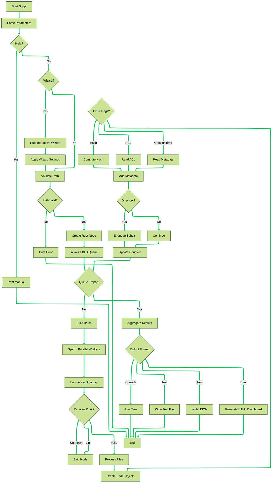

# treeAdv — Advanced, Safe & Fast Filesystem Tree

**treeAdv** (“Tree avanzato”) is a **fast, safe, multi‑threaded** filesystem tree generator for Windows PowerShell 7.x.  
It performs a **BFS traversal** with a **Runspace Pool** (no deep recursion), handles **OneDrive/Cloud Files** safely (skipping links/junctions; traversing cloud reparse points), and produces rich, professional outputs:

*   **Console / Text** (ASCII tree + summary)
*   **JSON** (hierarchical, with summary)
*   **HTML Analyzer** (modular web UI with Tree Explorer, Treemap, Heatmap, Delta Compare, Dashboard)

> Built for auditing, exploration, and reporting over small to very large directory trees.

***

## Table of Contents

*   \#features
*   \#requirements
*   \#installation
*   \#quick-start
*   \#command-line-options
*   \#outputs
    *   \#console--text
    *   \#json
    *   \#html-analyzer
*   \#html-analyzer-architecture
    *   \#modules
    *   \#dataset-location
    *   \#classification-catalog
*   \#usage-examples
*   \#working-with-very-large-trees
*   \#security--safety-notes
*   \#troubleshooting
*   \#contributing
*   \#license

***

## Features

*   **Multi-threaded BFS traversal** with a **Runspace Pool** → fast, memory-safe (no deep recursion).
*   **OneDrive-aware**:
    *   **Skips** symlinks/junctions;
    *   **Allows** OneDrive/Cloud Files reparse points (safe enumeration).
*   **Robust I/O**: guarded `try/catch`, optional **ErrorLog** for inaccessible paths, safe attribute reads.
*   **Always-on Summary**: clear, professional header (root, timestamp in Italian style, item counts, depth, extras, elapsed).
*   **Rich outputs**:
    *   **Console/Text**: readable ASCII tree with metadata example/legend.
    *   **JSON**: hierarchical model suitable for further processing.
    *   **HTML Analyzer**: modern, modular dashboard for exploration and auditing.
*   **Extras** (opt‑in): `a`=ACL (SDDL), `h`=Hash, `c`=CreationTime, `r`=ReadOnly, `s`=Hidden.  
    Hash algorithms: `SHA256` (default), `SHA1`, `MD5`.
*   **Wizard mode** for guided setup; **Debug mode** for verbose diagnostics.

***

## Requirements

*   **Windows PowerShell 7.x** (recommended).
*   Windows OS (tested on recent Windows 10/11).
*   Optional (HTML Analyzer): Internet access if you want **Font Awesome** via CDN; otherwise the UI gracefully falls back to emoji icons.

***

## Installation

1.  Clone or download this repository.
2.  Place `treeAdv.ps1` in a folder of your choice.
3.  Ensure the **template assets** folder is present alongside the script:

<!---->

    treeAdv_files/
      css/
        style.css
      mod/
        catalog.js
        core.js
        dashboard.js
        tree.js
        treemap.js
        heatmap.js
        compare.js

> These assets are **copied automatically** next to each generated HTML report (see #dataset-location).

***

## Quick Start

```powershell
# Basic: scan a directory and show output to console
.\treeAdv.ps1 -Path "C:\Data"

# HTML Analyzer (recommended)
.\treeAdv.ps1 -Path "C:\Data" -Output "C:\Reports\DataTree.html"

# JSON with hashes (SHA256)
.\treeAdv.ps1 -Path "C:\Data" -Output "C:\Reports\DataTree.json" -Extra h -HashAlgorithm SHA256
```

***

## Command-Line Options

*   `-Path <string>`  
    Root directory path (required unless using `-Wizard`).

*   `-Output <string>`  
    Output file (optional). If omitted and `Format=Auto`, output goes to console.  
    When `Format=Auto`, extension decides the format (`.txt` / `.json` / `.html`).

*   `-Format <Auto|Console|Text|Json|Html>` (default: `Auto`)  
    Format override.

*   `-MaxDepth <1..128>` (default: `20`)  
    Traversal depth (0=root, 1=children, …).

*   `-MaxDegreeOfParallelism <1..128>` (default: `8`)  
    Runspace pool size.

*   `-Extra <string[]>`  
    Extra attributes:  
    `a`=ACL (SDDL), `h`=Hash, `c`=CreationTime, `r`=ReadOnly, `s`=Hidden  
    Example: `-Extra a,h,c`

*   `-HashAlgorithm <SHA256|SHA1|MD5>` (default: `SHA256`)  
    Used only with `-Extra h`.

*   `-ErrorLog <string>`  
    Path to log inaccessible/guarded paths.

*   `-DebugMode`  
    Verbose diagnostics. Also enables JS debug inside HTML Analyzer.

*   `-Wizard`  
    Interactive guided setup.

*   `-Help`  
    Colorized manual with usage and examples.

***

## Outputs

### Console & Text

*   Summary header (root, timestamp, totals, extras, elapsed).
*   ASCII tree.
*   “Format sample” + legend explaining metadata shown for files.

### JSON

*   Hierarchical object with two main sections:
    *   `summary`: root path, timestamp, processed items, directories, files, depth limit, parallelism, extras, elapsed.
    *   `tree`: nested nodes (`directory`/`file`) with metadata (size, times, hash, ACL, cloud flags, etc.).

> Useful for downstream processing, diffing, and dashboards.

### HTML Analyzer

A complete, interactive Analyzer is produced when using `-Output <*.html>`.  
It ships the analyzer app next to the HTML (see below).

***

## Application Flow



## HTML Analyzer Architecture

The Analyzer is a self-contained web app with a **modular** design, loaded from the same folder as the report HTML.

### Modules

*   **`core.js`** – app bootstrap, dataset loading (via `fetch`), base layout, export CSV/JSON, page switching, dark mode.
*   **`dashboard.js`** – Summary (KV), metrics (files/dirs/size/duplicates/ACL risk), **Specification** legend, **Color Legend**.
*   **`tree.js`** – **Interactive Tree Explorer**
    *   Hierarchical, collapsible nodes; **Expand all/Collapse all**; **Expand matches**
    *   Live search (highlight + optional auto-expansion)
    *   Multi-select **extension filter** (auto-populated)
    *   **Badges** for category + HASH/ACL/CLOUD (with tooltips)
    *   Indentation by depth; icons per file type (Font Awesome if available; emoji fallback)
    *   Safety guards for very large DOMs
*   **`treemap.js`** – **Squarified Treemap** (like WinDirStat)
    *   Rectangles sized by file size, colored by category/extension
    *   Top-N cap (configurable) for performance
*   **`heatmap.js`** – **Directory Size Heatmap**
    *   Aggregated directory sizes; color-coded (small→green, medium→orange, large→red)
*   **`compare.js`** – **Delta Compare** between two scans
    *   Detects **NEW**, **DELETED**, **MODIFIED** (size/hash change)
    *   Summaries + lists (capped for performance)
*   **`catalog.js`** – **Central classification catalog**
    *   One source of truth for **categories**, **colors**, **icons**, **extension aliases**
    *   Exposes helpers: `fa_ext`, `fa_lookup`, `fa_color`, `fa_iconHtml`, `fa_category`, `fa_renderLegend`
    *   Optional **Font Awesome** via CDN; automatic emoji fallback if offline

### Dataset location

When you output **HTML**, the tool writes:

    <basename>.html
    <basename>_files/
      css/style.css
      mod/*.js
      data/<basename>.json   ← dataset used by the analyzer (loaded via fetch)

This keeps the HTML lean and the JSON independently inspectable.

***

## Usage Examples

```powershell
# 1) Simple console tree
.\treeAdv.ps1 -Path "C:\Data"

# 2) Text file output
.\treeAdv.ps1 -Path "C:\Data" -Output ".\tree.txt"

# 3) JSON with hashes + ACL
.\treeAdv.ps1 -Path "C:\Data" -Output ".\tree.json" -Extra h,a -HashAlgorithm SHA256

# 4) HTML Analyzer (with extras)
.\treeAdv.ps1 -Path "C:\Data" -Output ".\DataTree.html" -Extra h,c -DebugMode

# 5) HTML Analyzer via Wizard
.\treeAdv.ps1 -Wizard

# 6) Error log example
.\treeAdv.ps1 -Path "C:\Data" -Output ".\report.html" -ErrorLog ".\errors.txt"
```

***

## Working with Very Large Trees

*   **Traversal**: BFS + runspace pool keeps memory predictable.
*   **Analyzer Safety Caps** (in JS modules; tweak if needed):
    *   Tree explorer max items rendered: prevents sluggish DOM.
    *   Treemap: **Top \~400 files** (configurable constant) for responsiveness.
    *   Heatmap: **Top \~300 directories**.
    *   Delta compare: display caps (e.g., 3k results) to keep UI smooth.
*   **Hashes/ACL**: enable only when needed (`-Extra h,a`) to avoid overhead on large datasets.
*   **Exclusions**: the script prudently excludes common system folders; you can make this configurable if you need to traverse everything.

***

## Security & Safety Notes

*   **Links/Junctions** are skipped by default to prevent unintended traversal across volumes or loops.
*   **OneDrive/Cloud Files** reparse points are allowed but probed safely with guarded enumeration.
*   Hashing (`-Extra h`) reads full file contents; consider scope/performance and privacy.
*   ACLs (`-Extra a`) expose SDDL strings; handle/report them responsibly.

***

## Troubleshooting

*   **HTML shows no data**: check that `<basename>_files/data/<basename>.json` exists and is reachable next to the HTML.
*   **Icons missing**: likely offline; the Analyzer falls back to emoji. Optionally include Font Awesome CDN in the HTML head.
*   **Large dataset feels slow**: increase runspace pool moderately; reduce extras; accept Analyzer caps or raise them cautiously in JS constants.
*   **Access denied errors**: consult `-ErrorLog` output; ensure you have read permission to the target tree.

***

## Contributing

Contributions are welcome!

*   **Issues**: please describe environment (Windows version, PowerShell version), command used, expected vs actual behavior, and attach logs or minimal repro if possible.
*   **PRs**: keep changes modular. The HTML Analyzer relies on `catalog.js` for all classification—extend it rather than scattering mappings.
*   **Style**: prefer readable PowerShell, defensive I/O, and clear user messaging. In JS, keep modules small, no DOM bloat, and guard for large datasets.

**Roadmap ideas**:

*   Pluggable exclusion lists (`-ExcludeNames`, `-ExcludeSystem`)
*   Advanced security analyzer (well-known permissive ACLs, inheritance flags)
*   Local (non-CDN) Font Awesome bundle option
*   Optional CSV export server‑side (kept client‑side for now to avoid I/O contention)

***

## License

Unless otherwise stated, this project is released under the **MIT License**.  
You are free to use, modify, and distribute it. Please include attribution in derivative works.

***

## Acknowledgements

Thanks to everyone who tests on large, real-world datasets and provides feedback to improve performance, safety, and usability.

***

### Screenshots / GIFs (optional)

> Consider adding short GIFs showing Tree Explorer (collapse/expand, search/filter), Treemap, Heatmap, and Delta Compare to make the GitHub page even more welcoming.

***

**Enjoy fast, safe, and insightful filesystem exploration!**
